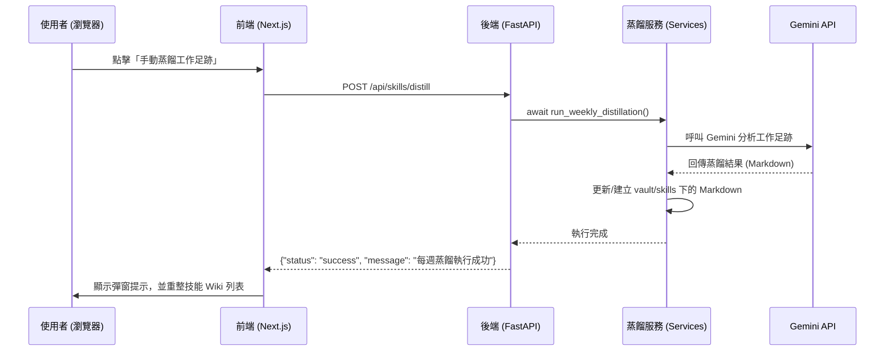

# 手動蒸餾工作足跡功能設計規格書 (Manual Distillation Spec)

- **日期**: 2026-07-11
- **狀態**: 已批准
- **目標**: 在前端介面新增「手動蒸餾工作足跡」按鈕，讓使用者可以隨時點擊觸發 AI 蒸餾最新日誌為技能 Wiki 頁面。

---

## 1. 系統架構與資料流 (Architecture & Data Flow)

使用者在前端點擊按鈕後，會透過 HTTP POST 發送請求給後端 API，後端呼叫蒸餾服務，再回傳成功。

---

## 2. 詳細變更內容 (Changes)

### 2.1 後端 API (Backend)
在 `src/pro_copilot/api/skills.py` 新增以下端點：
- **路徑**: `/api/skills/distill`
- **方法**: `POST`
- **處理器**: `trigger_distill()`
- **功能**:
  1. 匯入 `run_weekly_distillation`。
  2. 執行 `await run_weekly_distillation()`。
  3. 捕獲異常，若成功回傳 `{"status": "success", "message": "每週蒸餾執行成功"}`，若失敗回傳 `500 HTTPException`。

### 2.2 前端介面 (Frontend UI)
在 `frontend/src/app/page.tsx` 中做以下更新：
1. **狀態管理**:
   - 新增 `distilling` 狀態 (boolean, 預設為 `false`) 用於控制按鈕的載入中狀態。
2. **事件處理**:
   - 新增 `handleDistillData` 異步函式，向後端發送 `POST /api/skills/distill` 請求。
   - 包含對應的 `try/catch` 與錯誤/成功彈窗 (alert) 提示。
   - 成功後自動呼叫 `fetchData()` 重整畫面。
3. **UI 按鈕**:
   - 在「技能 Wiki 庫」分頁的右上角、原有的「重新同步向量庫」按鈕左側，新增手動蒸餾按鈕。
   - 風格選用綠色 (`bg-emerald-500/10 text-emerald-400 border border-emerald-500/20 hover:bg-emerald-500/20`)。
   - 使用 Lucide 的 `Cpu` 圖示，在蒸餾時旋轉。

---

## 3. 測試與驗證計畫 (Testing & Verification)

1. **後端編譯與啟動測試**:
   - 確保 FastAPI 正常編譯無語法錯誤。
2. **手動觸發測試**:
   - 前端點擊「手動蒸餾工作足跡」，確認按鈕進入禁用與載入狀態。
   - 觀察後端主控台，確認沒有出現 LLM 密鑰回退警告（應使用真實 API 金鑰）。
   - 驗證成功彈窗，並確認 `vault/skills/` 目錄下的 `.md` 檔案有被正確更新。
