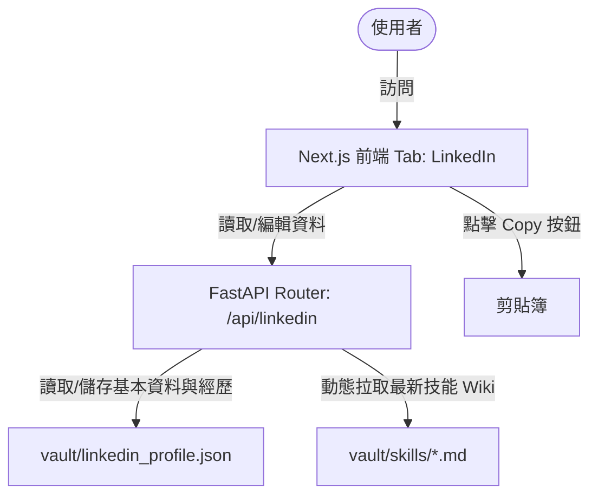

# 模擬 LinkedIn 個人頁面與手動複製功能設計文件

本文件描述了如何在個人職涯副駕駛 (Pro-Copilot) 系統中，新增一個模擬 LinkedIn 個人頁面的功能，協助使用者輕鬆複製與貼上最新個人簡介、經歷與技能到真實的 LinkedIn 帳號中。

## 1. 背景與動機
使用者希望能有一個模擬 LinkedIn 個人頁面的頁面，方便將系統中最新的技能 Wiki、客製化履歷與工作日誌內容整理成適合 LinkedIn 貼上的格式，並透過點擊「複製」按鈕，快速手動貼上到 LinkedIn，以便在不進行 API 自動對接（具安全風險與 API 限制）的情況下，保持 LinkedIn 個人檔案為最新狀態。

## 2. 系統架構與流程

本功能主要由後端 JSON 持久化與 API、前端 Next.js 模擬 UI 兩部分組成：



1. **基本資料與經歷** 儲存於 `vault/linkedin_profile.json`，方便編輯與直接保存。
2. **專業技能** 動態掃描 `vault/skills/` 目錄下的所有技能 Markdown 卡片，保持與系統最新狀態同步。
3. **前端 UI** 模擬 LinkedIn 卡片式版面，呈現「個人橫幅與基本資料」、「關於我 (About)」、「工作經歷 (Experience)」、「專業技能 (Skills)」四個主要區塊，每個區塊旁都設有 Copy 按鈕。
4. **編輯模式** 前端提供開關，可直接編輯基本資料與經歷，並發送 API 儲存至後端 JSON。

---

## 3. 方案選擇 (Design Alternatives)

### 方案 1：JSON 檔案持久化與動態技能結合 (推薦)
* **設計**：
  * 後端建立一個 JSON 檔 `vault/linkedin_profile.json` 來存 LinkedIn 的「基本資料（姓名、頭銜、地區、關於我）」與「經歷列表 (Experience)」。
  * 後端提供 `GET /api/linkedin`，讀取 JSON，並與 `vault/skills/` 的技能列表整合，回傳完整的個人檔案 JSON。
  * 後端提供 `PUT /api/linkedin`，將前端傳來的個人資料與經歷儲存到 JSON 檔中。
  * 前端在 `page.tsx` 新增 Tab "linkedin"，模擬 LinkedIn 個人頁面的佈局（Headline、About、Experience、Skills），並提供複製與編輯功能。
* **捨棄理由 / 優點**：實現簡單，資料容易備份與直接編輯（在 Obsidian 或編輯器中），技能動態同步。

### 方案 2：全 AI 自動生成與唯讀 (捨棄)
* **設計**：每次讀取時均透過 LLM 自動分析所有技能與日誌，動態生成一份 LinkedIn Profile。
* **捨棄理由**：耗費 Token、無法精準控制（例如職稱名稱、具體時間），且無法提供快速的手動編輯功能。

### 方案 3：資料庫儲存 (捨棄)
* **設計**：在 PostgreSQL 中建立相關 Table。
* **捨棄理由**：不符合 Pro-Copilot 主要將使用者可讀的知識庫與資料存在 `vault/` 目錄下的設計習慣，且不利於使用者手動用 Obsidian 編輯基本資料 JSON。

---

## 4. 詳細設計

### 4.1 後端設計 (API 與資料模型)

#### 4.1.1 資料儲存：`vault/linkedin_profile.json`
如果檔案不存在，後端將建立預設檔案。內容格式如下：

```json
{
  "name": "杜偉宏",
  "headline": "軟體工程師 | 專注於 Python, FastAPI, Next.js 與 AI 應用開發",
  "location": "台灣台北市",
  "about": "熱愛解決問題的全端開發者，擅長建構高併發的後端系統與現代化的前端應用。近期專注於大語言模型整合 (LLM) 與 RAG 向量搜尋系統的建置。",
  "experiences": [
    {
      "company": "智慧科技股份有限公司",
      "title": "資深全端工程師",
      "location": "台北市",
      "start_date": "2024-01",
      "end_date": "至今",
      "description": "• 使用 FastAPI 與 Python 開發高性能後端 API，優化 WebSocket 通訊效能。\n• 重新設計 Next.js 與 React 前端架構，成功提升載入速度達 40%。\n• 設計並建構基於 Qdrant 的向量檢索與 RAG 系統，提昇問答準確率達 15%。"
    }
  ],
  "educations": [
    {
      "school": "國立台灣大學",
      "degree": "資訊工程學士",
      "start_date": "2018-09",
      "end_date": "2022-06"
    }
  ]
}
```

#### 4.1.2 路由設計：`src/pro_copilot/api/linkedin.py`
1. **`GET /api/linkedin`**：
   - 讀取 `vault/linkedin_profile.json` 的內容。
   - 讀取 `vault/skills/` 的技能列表，擷取技能的名稱、熟練度與核心技術，轉換為 LinkedIn 可貼上的技能清單格式。
   - 合併兩者並回傳。
2. **`PUT /api/linkedin`**：
   - 接收 JSON Payload，並將其寫回 `vault/linkedin_profile.json`。

### 4.2 前端設計 (Next.js)

#### 4.2.1 UI 佈局 (LinkedIn 卡片風格)
前端在 `page.tsx` 的 Tabs 中新增一個 `linkedin` Tab。其畫面採用 LinkedIn 的經典設計：
* **Header 卡片**：大橫幅、頭像預留圈、大姓名、Headline（一鍵複製）、地區與聯絡資訊。
* **About 卡片**：摘要內容、一鍵複製按鈕。
* **Experience 卡片**：清單顯示每項經歷，包含公司、職稱、時間、描述（一鍵複製）。
* **Skills 卡片**：顯示從 Wiki 撈取出來的技能，並提供一鍵複製按鈕。
* **編輯模式**：點擊「編輯個人檔案」按鈕，可以把上述基本資料與經歷列表變成 Form 輸入欄位（支援新增/刪除經歷），點擊儲存寫回後端。

#### 4.2.2 複製文字格式化規範
當使用者點擊「複製」時，格式必須乾淨且適合 LinkedIn：
* **Headline**：直接複製 Headline 字串。
* **About**：直接複製 About 內文。
* **Experience** (單項或全部)：
  ```text
  [公司名稱] - [職稱]
  期間：[開始時間] ~ [結束時間] | 地區：[地點]
  
  工作內容與成就：
  [詳細描述]
  ```
* **Skills**：
  ```text
  專業技能清單：
  • [技能名稱 1] (熟練度: [熟練度]) - 核心技術: [核心技術]
  • [技能名稱 2] (熟練度: [熟練度]) - 核心技術: [核心技術]
  ```

---

## 5. 潛在風險與防範 (Risks & Mitigations)
* **格式崩潰**：若使用者自行編輯了 `vault/linkedin_profile.json` 且造成 JSON 語法損毀。
  * *防範*：後端讀取時若解析失敗，會主動回報 400 錯誤，並提供自動修復（將損毀檔案備份，並重設為預設範本）或是提供明細錯誤訊息。
* **CSRF/未授權存取**：此為 local 單機/內部開發輔助系統。
  * *防範*：目前無須額外認證，CORS 僅限本機 `http://localhost:3000`。
