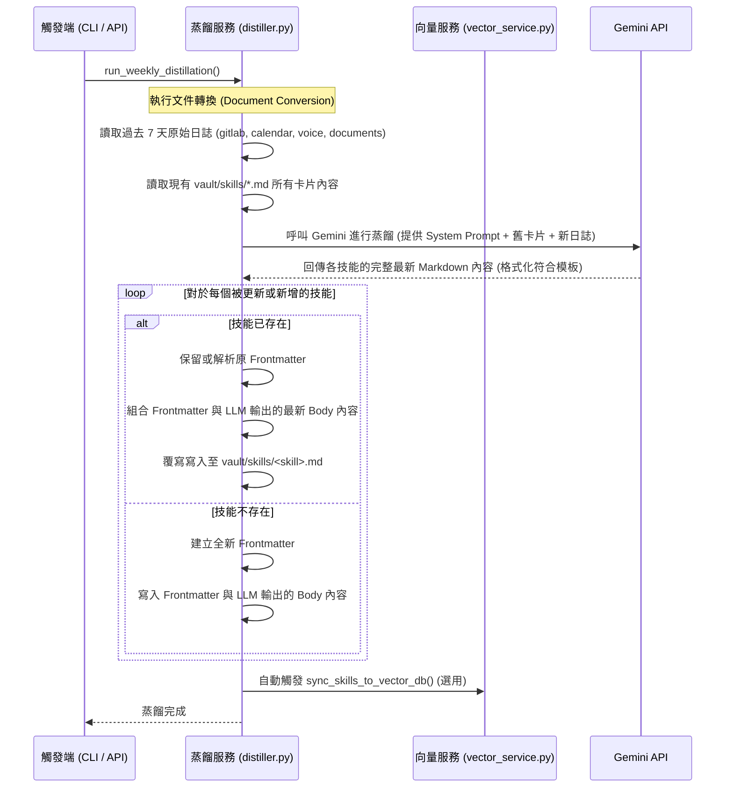

# 技能卡片模板化與 AI 蒸餾流程重構設計規格書 (Skill Template & Distillation Design Spec)

- **日期**: 2026-07-12
- **狀態**: 已批准
- **目標**: 重構技能蒸餾分析的 LLM Prompt 與寫入邏輯，導入包含「技能說明」與「專案紀錄」的固定 Obsidian 模板。

---

## 1. 系統架構與資料流 (Architecture & Data Flow)

本設計採用**方案 1：LLM 完全覆寫與合併**。當系統分析新的原始工作日誌並發現需要「更新」現有技能卡片時，LLM 將會合併「既有卡片內容」與「新工作紀錄」，並輸出**包含完整歷史與新專案合併後**的最新技能 Markdown 內容，由後端程式完全覆寫技能檔案。



---

## 2. 詳細變更內容 (Changes)

### 2.1 技能卡片 Markdown 固定模板
所有在 `vault/skills/` 下的 Markdown 技能卡片，其 Body 結構必須符合以下固定模板：

```markdown
## 技能說明
- **核心描述**：[簡述此技能的專業定義與主要應用場景]
- **熟練程度**：[精通 / 熟練 / 熟悉 / 基礎]
- **核心技術**：[技術 A, 技術 B, 技術 C]

## 實際專案紀錄

### [專案名稱 A]
- **情境 (Situation)**：[情境說明]
- **任務 (Task)**：[任務說明]
- **行動 (Action)**：[行動說明]
- **結果 (Result)**：[結果說明]
```

### 2.2 LLM 系統提示詞變更 (System Prompt)
在 `src/pro_copilot/services/distiller.py` 中更新 `SYSTEM_PROMPT`：
1. **模板格式規範**：強制要求 LLM 使用 `## 技能說明` 與 `## 實際專案紀錄` 的標題結構。
2. **更新合併規範**：特別規定 LLM 在分析新日誌並標註 `[更新]` 時，必須**融合現有技能檔案的舊內容**，將新紀錄以 `### [專案名稱]` 加入到 `## 實際專案紀錄` 底下，並重新調整 `## 技能說明` 中的熟練度與核心技術。LLM 不得僅輸出片段，必須輸出**該技能卡片的完整最新 Body 內容**。

### 2.3 後端寫入邏輯變更 (Writer Logic)
在 `src/pro_copilot/services/distiller.py` 的 `run_weekly_distillation` 函數中：
- 調整 `filepath.exists() and is_update` 區塊。
- 不再使用 `existing.rstrip() + f"\n\n## 更新 ({now_str})\n\n" + body` 這類簡單尾端追加。
- 改為：
  1. 讀取原檔案內容，嘗試提取 YAML Frontmatter（包含 `created_at`、`tags` 等）。
  2. 如果原檔案沒有 frontmatter，則建立一個。
  3. 將 Frontmatter 與 LLM 輸出的完整新 `body` 進行組合。
  4. 寫入覆寫原檔案，達成無痕式的「完全覆寫與合併」。

---

## 3. 測試與驗證計畫 (Testing & Verification)

1. **基礎語法檢查**:
   - 確保 `distiller.py` 修改後無 Python 語法錯誤。
2. **蒸餾功能驗證**:
   - 提供一份包含舊專案的 Python 技能卡片，並模擬新的 Python 工作日誌。
   - 執行 `uv run pro-copilot distill`。
   - 驗證 `vault/skills/python.md`：
     - 是否正確將新舊專案整合在 `## 實際專案紀錄` 下。
     - 是否符合 `## 技能說明` 與 `## 實際專案紀錄` 的雙段落結構。
     - YAML Frontmatter 中的 `created_at` 應維持原始建立日期，而非當前日期。
3. **履歷生成整合驗證**:
   - 執行 `uv run pro-copilot generate --jd ./jobs/target-JD.md`。
   - 確認 `cv_generator.py` 能成功讀取新格式的技能卡片，且生成的客製履歷內容正確。
